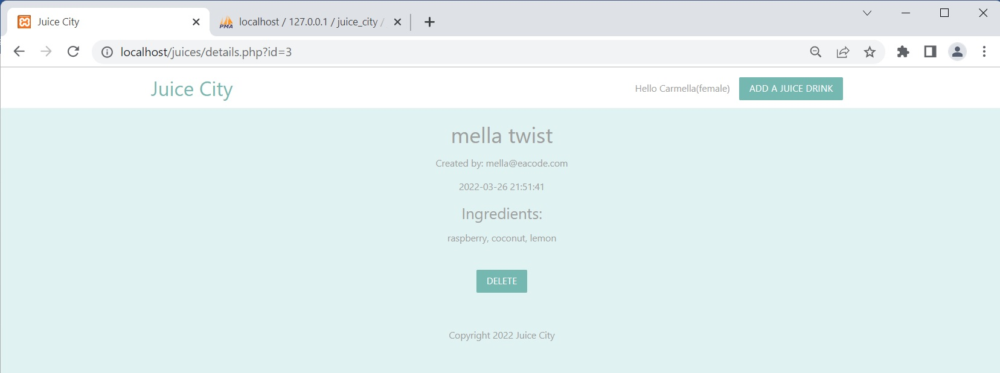
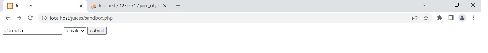

# juice_city
A simple PHP website where you can add new juice drink and delete a juice drink which will be stored in a MySQL database.

# Images below.

  

# About

The juice city project, software used for this is: Frontend: HTML, css- Materialize to style the webpage, php for the backend, mySQL for the database. 
A Simple PHP website about adding a juice drink or deleting one. The juice drinks will be stored in a MySQL database. The user will fill out the form with their email, the title of drink they want and the ingredients there would like. The name of the drink and the ingredients will be sent to the main page. You can then click on more info view the name of juice drink, email of who created it, date and time, the ingredients and a delete button to remove this drink if you want to. The mySQL database stores the juice drinks, users added from the juice city website. In the header is a section to the right, there is a cookie which holds a user name. This has been stored on a external sandbox.php page linked to the main website. You can also select the gender of the user and it's dispalyed in the header section on all pages in the website. However if no person has been selected when first entering the website it will display Hello Guest(unknown). 
